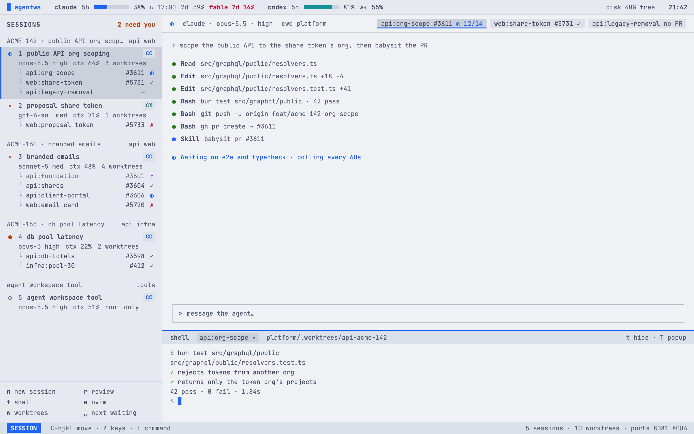
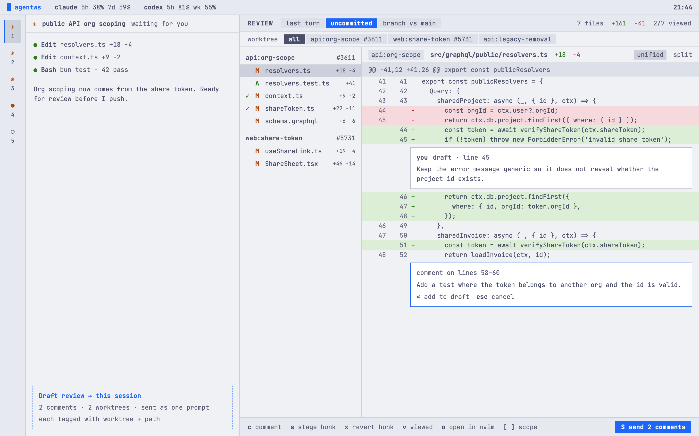
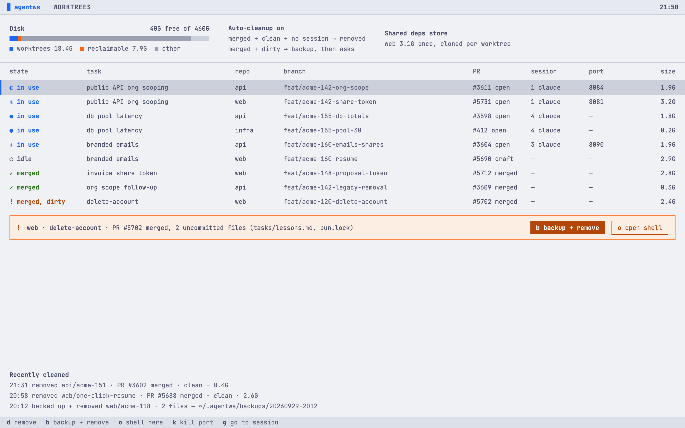
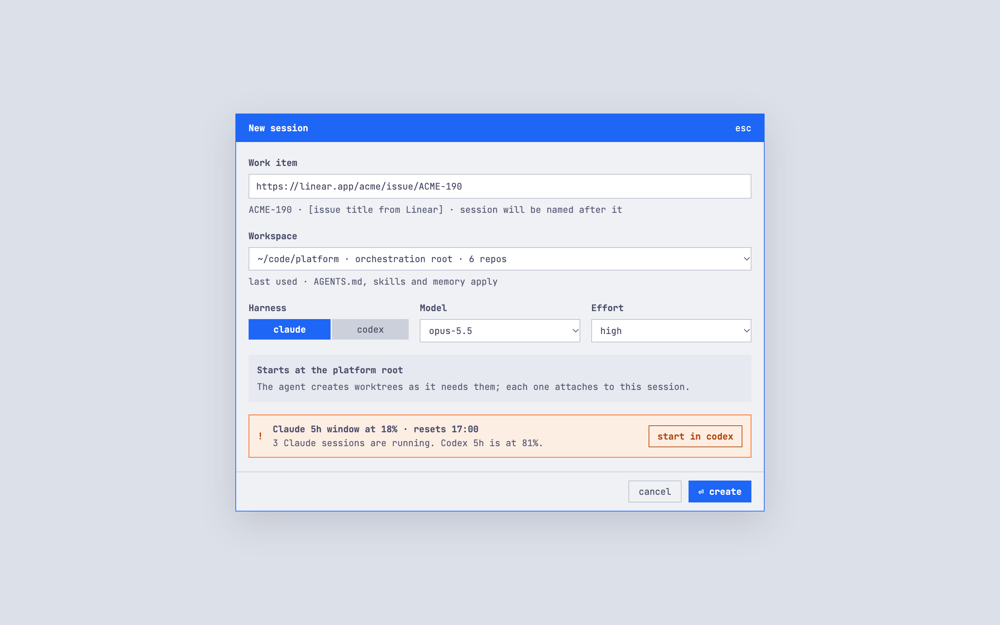

# agentws (working name)

A terminal workspace for running Claude Code and Codex sessions in parallel. It creates and cleans up git worktrees for you, and lets you review what agents changed in a local, PR-style pane.

**Status:** pre-alpha. The design and the [v1 issues](https://github.com/giovaniif/agent-workspace/milestone/1) exist; nothing is installable yet. The screens below are design mockups.



## What it does

- **Sessions side by side.** Claude Code and Codex run next to each other, grouped by task and named after the issue or PR they work on. Each shows its state (running, waiting, done), model, effort, and how much context is left.
- **Notifications.** You get one when an agent needs permission, is waiting on you, or finishes, whichever harness it is.
- **Limits.** The Claude 5h/7d windows and the Codex limits sit in one bar, with a warning before you start a session on a nearly exhausted quota.
- **Worktrees handled for you.** The agent creates worktrees, and each one is attached to the session that made it. When its PR merges, it is removed automatically if it has no uncommitted changes. If it does, they are backed up and you're asked first. Branches are never deleted.
- **Local review.** Diff the last agent turn, the uncommitted changes, or the whole branch. Comment on lines and send all the comments to the agent as one prompt.
- **Shell and nvim one key away.** Both open in the right worktree. Diffs open in nvim through diffview.
- **Single repo or multi-repo.** Point it at a single repo or at a folder that holds several service repos.

## Screens

| Review | Worktrees and disk |
|---|---|
|  |  |



## How it works

- One Go binary acts as the daemon, the TUI, the CLI, and the hook handler.
- Agents run in panes on a separate tmux server (`tmux -L agentws`). Your own tmux setup is left alone, and sessions survive closing the terminal.
- Claude Code and Codex hooks report state to the daemon over a local socket. The hook handler exits in under 20 ms, so agents never wait on it.
- git, gh and tmux are called as command-line tools; nothing reimplements them.

The details are in [ARCHITECTURE.md](ARCHITECTURE.md), and the full scope is in [FEATURES.md](FEATURES.md).

## Requirements (planned)

macOS, tmux, git, the GitHub CLI (`gh`, signed in), and Claude Code and/or the Codex CLI.

## Build and test

Needs Go (version in `go.mod`), `golangci-lint` v2, and for `make mutate` `gremlins`.

```sh
make build             # ./bin/agentws
./bin/agentws version
./bin/agentws debug seed 3 && ./bin/agentws   # the sidebar with 3 fake sessions
make test              # go test ./...
make lint              # golangci-lint + scripts/lint-comments
make e2e               # testscript suite in test/e2e
make bench             # benchmarks for the performance budgets
make mutate            # gremlins on internal/domain and internal/app
```

Integration tests use `-tags integration` and need `git` and `tmux`.

## Contributing

The build is test-driven and CI enforces it. Read [AGENTS.md](AGENTS.md) before opening a PR: it covers the layer rules, tests first, no low-value tests or comments, and one PR per issue.
